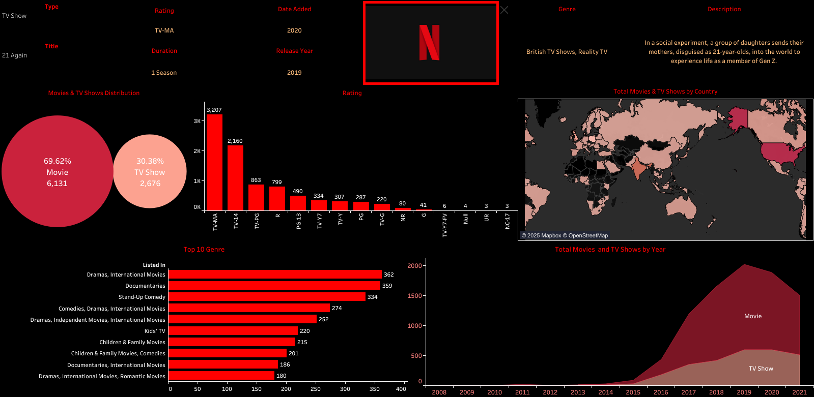

# 📺 Netflix Data Visualization Dashboard (Tableau)


## 🔍 Project Overview
This project is a **data visualization dashboard** created using **Tableau** that analyzes Netflix’s vast content library.  
The dashboard uncovers insights such as:
- The most common content types  
- Popular genres  
- Distribution by country  
- Release year trends  
- Content ratings  

This is useful for understanding how Netflix distributes its content, what kind of shows or movies dominate the platform, and how its catalog has evolved over the years.

---

## 📊 Key Insights from the Dashboard
- **Total Titles:** 8807  
- 🎬 **Movies:** 6131  
- 📺 **TV Shows:** 2676  
- **Most Popular Genre:** Drama, International Movies (362 titles)  
- **Top Content-Producing Countries:** United States(2818) and India(972)  
- **Ratings Distribution:** Mostly TV-MA and TV-14 content 

---

## 🛠️ Tools & Technologies Used
- 📈 **Tableau** – for creating and visualizing interactive dashboards  
- 🗃 **Dataset** – Netflix Movies and TV Shows Dataset from Kaggle  
- 🖼 **Dashboard Image** – Exported as PNG for preview  

---

## 📈 Dashboard Components
- **Pie Chart** – Distribution between Movies and TV Shows  
- **Bar Charts** – Top 10 genres and ratings count  
- **Map** – Content availability by country  
- **Area Chart** – Number of releases by year  
- **Highlight Table** – Example title breakdown (Genre, Description, Rating, Duration)  

---

## 📥 How to View the Dashboard
1. Clone the repository:
   ```bash
   git clone https://github.com/DevDreamsAK/Netflix_Dashboard.git
   ```
2. Open Netflix_Dashboard.twb in Tableau Desktop or Tableau Public.
   https://public.tableau.com/app/profile/akash.ahamed/viz/NetflixMoviesDashboard_17580205761010/Netflix?publish=yes

---

## 📌 License
This project is intended for educational and non-commercial purposes.
The dataset is publicly available via Kaggle and owned by their respective data providers.

---

## 🙌 Acknowledgments
Kaggle – for the open-source Netflix dataset.

Tableau Public – for providing powerful data visualization tools.


---
